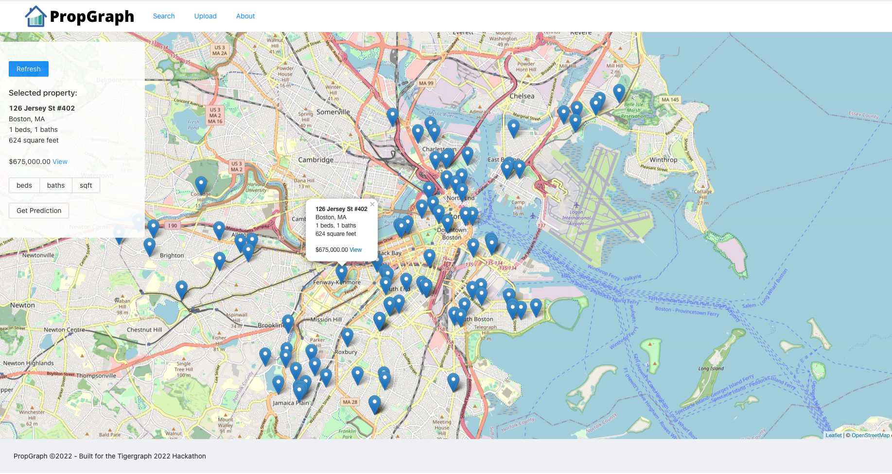

    

## Contributors and Contact Information:

Chris Buonocore
linkedin.com/in/chrisbuonocore
chrisdistrict@gmail.com

## Problem Statement addressed:

PropGraph: A graph database comparable model for real estate.

<!--
PropGraph: A property graph database.
Template: https://github.com/TigerGraph-DevLabs/graph-for-all-submission-template
 -->

Intro slides: https://docs.google.com/presentation/d/1UGDiIgigPEodtkFg_F-mBde0eaogOYEyHCJ-S14rk3M/edit?usp=sharing

**Description**:

PropGraph: Find undervalued and comparable properties using graph-based relationships powered on TigerGraph.

With real estate at a recent all time demand high, the need for determining valuations effectively is important as ever. Often comparables for real estate valuation are derived at the discretion of the real estate agent, or simply based off the zestimate or redfin estimate for a property.

These methods can also be extremely opaque - with little to no visibility into the exact parameters that influence the price.

When an agent picks comparables, often this goes one layer deep - ex: the property is compared to three adjacent properties.

PropGraph provides a graph based solution that allows querying a given property and finding deeper relationships against recently sold properties. With PropGraph, you can take many 1-layer graphs (ex: one agent doing a comparable on a property) and go N layers deep instead by mapping across all comparables shared by multiple agents. With this strategy you can compare a property in Boston to a property that recently sold in the UK for example via transitive graph.

Key graph elements:

- Descriptive words (renovated, new kitchen, new bathroom, flooring, etc.)

Standard quantitative fields:

- Bedrooms
- Bathrooms
- Square footage

- Relationships between different property keywords.
- Find corresponding properties based on graph relationships matching multiple criteria simultaneously.
- Helps reduce bias in real estate pricing.
- Ingests and graphs data through several mainstream real estate websites, including Redfin, Zillow, and Trulia.
- Creates a valuation and visualization model in real time and serves it to the front end application.

## Data

Example dataset in `./data/sample.csv`.
More could be exported in basic searches from Redfin (redfin.com).

## Technology Stack:

- ReactJS
- Python
- pyTigerGraph

## Visuals

Map view of uploaded properties

Upload page for submitting property data to database.

Network page for visualizing related properties

Calculating comparables based on in-view properties.

Graph creation

Comparable network query

## Dependencies

State any dependencies and their versions needed to be installed to test this project. This may include programming languages, frameworks, libraries, and etc.

## Installation

Clone this repo and follow the steps below for the backend and frontend configuration locally.

### Structure

`./propgraph`: Client-side code.
`./server`: Jupyter notebook to configure the graph DB and backend server code.
`./data`: Example property data.
`./img`: Example screenshots of the application.

#### Backend

1. Set up a tigergraph cloud instance at tgcloud.io, set the credentials to access that instance via the following environment variables.

<pre>
    TIGER_HOST={YOUR_TIGERGRAPH_HOST}
    TIGER_USER={YOUR_TIGERGRAPH_USER}
    TIGER_PW={YOUR_TIGERGRAPH_PASSWORD}
    TIGER_TOKEN={YOU_TIGERGRAPH_TOKEN} # optional, fetched at runtime if unset.
</pre>

2. To bootstrap base/empty graph for PropGraph, run a jupyter notebook from the `./server` directory and open `graphsetup.ipynb`. Install dependencies in first cell and run all cells below.
3. `chmod 755 run.sh`
4. Run `./run.sh`

The server should now be running on port 8000.

### Bootstrap the Database

You'll want jupyter to run the DB-setup commands.
From the `./server` folder:
`jupyter-notebook` (or lab).

Run the commands to the end; if successful, the graph should be a created and a few sample queries should execute.

#### Frontend

From the `./propgraph` folder:

<pre>
yarn
yarn start
</pre>

The PropGraph frontend should now be running on port 3000.

You'll want to load up the DB with some properties from the 'Upload' page of the app to begin using PropGraph with your Tigergraph database.

## Known Issues and Future Improvements

- Include in-app visualization for comparable graph (currently capture-able in the notebook for further/future analysis)

## Reflections

Tigergraph has a unique value prop to do 'Nth' comparable level queries against properties to yield deeper insight than what could easily be done with a traditional database.

## References

- Tigergraph solutions: https://tgcloud.io/app/solutions
- More credits: https://docs.google.com/forms/d/e/1FAIpQLSdoK6wIj4iFJtzeFWFl4yPQK6h8TzmQMsYnG6upZiM1A8W5VQ/viewform
- Notebook: https://github.com/pyTigerGraph/pyTigerGraph/blob/master/examples/GSQL101%20-%20PyTigerGraph.ipynb
